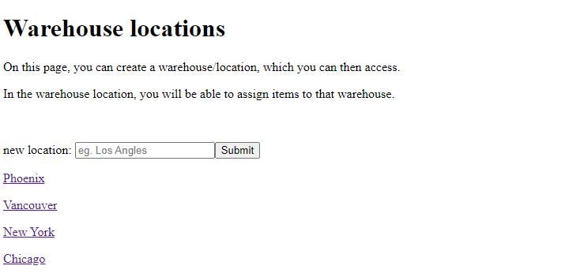
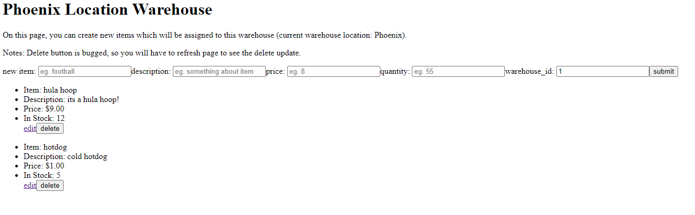
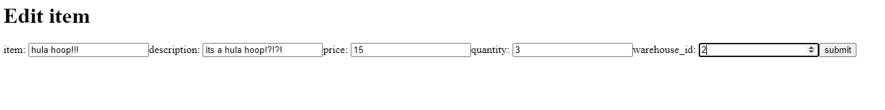

# Warehouse Inventory Tracker

This project was developed for Shopify's Fall 2022 Internship backend coding challenge.
Technologies used in this project includes Python, Flask, SQLalchemy, PostgreSQL, and React/Redux to showcase the web application.

replit: https://replit.com/@Breadsandwich/inventoryapp#.replit

## Project Features
### Basic features
* User is able to create new inventory items.
* User is able to Edit inventory items.
* User is able to Delete inventory items.
* User is able to view list of inventory items.

### Additional feature
* Ability to create warehouses/locations and assign inventory to specific locations

## Set-up instructions on local environment
1. Clone this repository `git clone git@github.com:Breadsandwich/inventory_app.git`
2. In the root directory, install dependencies `pipenv install --dev -r dev-requirements.txt && pipenv install -r requirements.txt`
3. In the root directory, create an `.env` file based off the `.env.example`.
4. Set up postgreSQL user and database so it matches your `.env` file.
    * `create user <your_username_here> with password '<your_password_here>' createdb`
    * `create database <your_database_name_here> with owner <your_username_here>`
5. Get into pipenv, migrate the database, seed the database, and run the flask app using the following commands:
   * `pipenv shell`
   * `flask db upgrade`
   * `flask seed all`
   * `flask run`
6. cd into react-app and run `npm install` then `npm start`

## Testing endpoints on Postman
1. First we need a warehouse location, lets make one.
```
// Input
POST /api/warehouses/new
{
    "location": "New York"
}

// Output
{
    "id": 1,
    "location": "New York",
    "warehouse_inventory": []
}
```
2. Now that we have a warehouse, or a few. Lets take a look at the list.
```
// Output
GET /api/warehouses/all
{
    "all_warehouses": [
        {
            "id": 1,
            "location": "New York",
            "warehouse_inventory": [{...Inventory list populates here}]
        }
}

// Output
GET /api/warehouses/1
{
    "id": 1,
    "location": "New York",
    "warehouse_inventory": [
        {
            "description": "example description!",
            "id": 9,
            "item_name": "example item",
            "price": "9.00",
            "quantity": "12",
            "warehouse_id": 1
        },

    ]
}
```
3. From this point, we can start building our inventory of items. [Create Items]
```
// Input
POST /api/inventory/new
{
    "item_name": "test item",
    "description": "secret test item.",
    "price": "7.00",
    "quantity": 5,
    "warehouse_id": 1
}
// "warehouse_id" is what gives the item association with a warehouse!
// This is designed as 'one warehouse has many items', one-to-many relationship

// Output
{
    "description": "secret test item.",
    "id": 1,
    "item_name": "test item",
    "price": "7.00",
    "quantity": "5",
    "warehouse_id": 1
}
```
4. We can take a look at the our inventory. [Read Items]
```
// View all items.
// Output
GET /api/inventory/all
{
    "all_items": [
        {
            "description": "secret test item.",
            "id": 1,
            "item_name": "test item",
            "price": "7.00",
            "quantity": "5",
            "warehouse_id": 1
        },
        {
            "description": "secret test item.",
            "id": 1,
            "item_name": "test item",
            "price": "7.00",
            "quantity": "5",
            "warehouse_id": 2
        }
    ]
}

// View individual item.
// Output
GET /api/inventory/1
{
    "description": "secret test item.",
    "id": 1,
    "item_name": "test item",
    "price": "7.00",
    "quantity": "5",
    "warehouse_id": 1
}
```

5. If we want to change something, we can use the update route. [Update Item]
```
// Input
PUT /api/inventory/<int:itemId>
{
    "item_name": "test item updated",
    "description": "secret test item. updated",
    "price": 10,
    "quantity": 2,
    "warehouse_id": 1

}

// Output
{
    "description": "secret test item. updated",
    "id": 1,
    "item_name": "test item updated",
    "price": "10.00",
    "quantity": "2",
    "warehouse_id": 1
}

```

6. If we don't want an item anymore, we can delete an item with the delete route. [Delete Item]

```
// Deleting an item will return a string that confirms deletion of selected itemId.
// Output
DELETE /api/inventory/<int:itemId>

return 'Deleted item Id: 1'
```

## Web application demo photos
### Create and view warehouses


### view Warehouse with assigned inventory
On this page, users will be able to view the inventory assigned to a warehouse location. Users may also create new items that will be assigned to the current warehouse.


### Edit item page
On this page, users are able to edit the selected item from above

